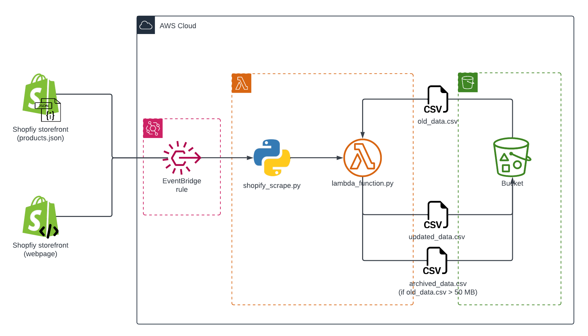

# ariana_grande_store_inventory

The repository contains an ongoing project to collect data from [Ariana Grande's webstore](https://shop.arianagrande.com/), hosted by Shopify. Data collection is currently underway on a serverless AWS framework, using AWS Lambda, Amazon S3, and Amazon Eventbridge, from 7 March 2024 until 7 April 2024.

## Architecture and process

1. Amazon Eventbridge rules trigger AWS Lambda every five minutes, invoking [`shopify_scrape.py`](.src/shopify_scrape.py).
2. `shopify_scrape.py` pulls raw data both from the storefront and from the public-facing `products.json` file, which is used for every Shopify storefront. The code then formats the data before passing it to [`lambda_function.py`](./src/lambda_function.py).
3. `lambda_function.py` fetches an existing CSV file out of a connected S3 bucket. The Lambda appends the new data to the CSV file before putting it back in the bucket, replacing the original.

## Directory
* **[data](./data)**: contains all webscraping data *(currently empty until data collection is complete)*
* **[figures](./figures)**: contains project pngs, including architecture diagram (courtesy of [Lucidchart](https://www.lucidchart.com/pages/))
* **[src](./src)**: contains all Python modules and scripts used in project, including the Lambda function
